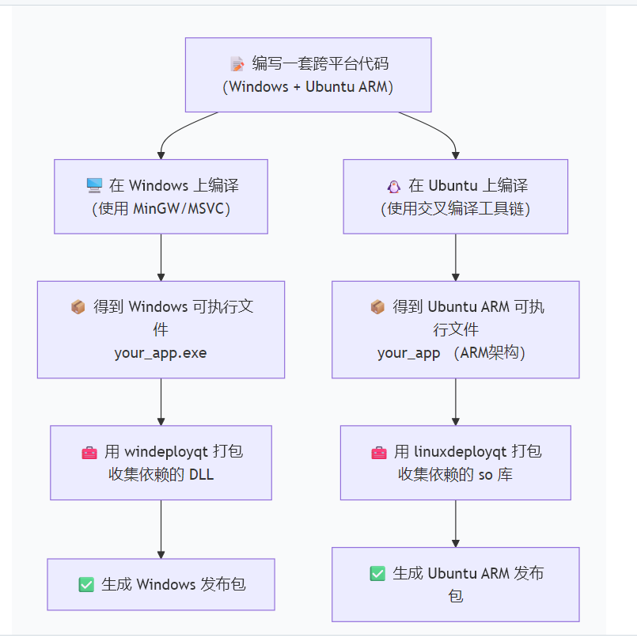

# 上位机(QT)与下位机(单片机)通信


- - ### 一、 你需要向公司（或硬件/嵌入式工程师）索要什么资料？

    在写任何代码之前，明确需求和通信规则。你需要找相关同事要以下相关文件：
  
    1. **通信协议文档（最核心！）**
       - 这是重中之重。你需要知道 Qt 和单片机之间用什么“语言”对话。
       - **物理层：** 是用串口（UART/RS232/RS485）、网口（TCP/UDP）、USB 还是 CAN 总线？（最常见的是串口）。
       - **参数配置：** 如果是串口，波特率、数据位、停止位、校验位是多少？
       - **数据帧格式（应用层）：** 数据是怎么打包的？比如：`[帧头] + [命令字] + [数据长度] + [有效数据] + [校验码(CRC/校验和)] + [帧尾]`。你需要明确每一个字节代表什么意思。
    2. **需求说明书 / 界面草图**
       - **显示需求：** 界面需要实时显示单片机发来的哪些数据？（如温度、速度、状态指示灯、实时曲线等）。
       - **控制需求：** 界面需要向单片机发送什么指令？（如启动、停止、设置参数等）。
       - 有没有历史数据保存（存入数据库或 Excel）、报警提示等高级需求？
    3. **硬件设备与配件**
       - 一块烧录好程序的**单片机测试样板**。
       - 必要的**连接线**（比如 USB 转 TTL 串口模块、网线等）。
       - 如果有特定的传感器或电机连接在单片机上，最好也能有一套，方便你直观看到控制效果。
    4. **现成的测试工具或单片机调试助手（可选但强烈建议）**
       - 问问写单片机代码的同事，他们平时用什么工具（如串口调试助手 XCOM、SSCOM 等）测试？让他们把能成功通信的**十六进制指令示例**发给你。
  
    ------
  
    ### 二、 你应该怎么写这个项目？（开发步骤）
  
    拿到资料后，你可以按照以下步骤来搭建你的 Qt 上位机：
  
    **第一步：跑通底层通信（以最常见的串口为例）**
  
    - 不要一上来就画复杂的界面。先新建一个 Qt 工程，引入 `QSerialPort` 和 `QSerialPortInfo` 模块（在 `.pro` 文件中加上 `QT += serialport`）。
    - 写一个极简的界面：一个打开串口的按钮，一个发送按钮，一个接收文本框。
    - 实现：扫描可用串口、配置波特率、打开/关闭串口、调用 `write()` 发送数据，连接 `readyRead()` 信号来接收数据。
    - **目标：** 能用 Qt 成功给单片机发一条指令，并收到单片机的回复。
  
    **第二步：编写“协议解析”类（数据打包与解包）**
  
    - 这是代码中最容易出错的地方。你需要写一个专门处理数据的类。
    - **组包（Qt -> 单片机）：** 将用户在界面上输入的值，按照“通信协议文档”拼接成完整的字节数组（`QByteArray`），计算好校验码，再发送出去。
    - **解包（单片机 -> Qt）：** 接收串口数据时，注意处理**“粘包”**和**“半包”**问题（即一次收到的数据可能不是一整帧，或者包含多帧）。你需要根据帧头和帧尾来截取有效数据，校验无误后，提取出温度、电压等具体数值。
  
    **第三步：设计 UI 界面**
  
    - 使用 Qt Designer 画出满足需求的界面。
    - 善用控件：用 `QLCDNumber` 显示数字，用 `QLabel` 切换红绿图片表示状态灯，用 `QChart` 绘制实时数据曲线，用 `QTextBrowser` 显示通信日志。
  
    **第四步：前后端逻辑绑定**
  
    - 利用 Qt 的**信号与槽（Signals and Slots）**机制。
    - 当协议解析类成功解出一帧数据时，发射一个信号（比如 `signal_temperatureUpdated(float temp)`）。
    - UI 界面接收到这个信号后，在槽函数里更新对应的控件（`ui->label_temp->setText(...)`）。
  
    ------
  
    ### 三、 实战避坑指南（非常重要）
  
    
    
    - **不要阻塞主线程：** 界面（主）线程只负责更新 UI。如果你有耗时的操作（比如复杂的计算、大文件保存），一定要放到子线程（`QThread`）中去做，否则界面会卡死（表现为窗口拖不动、点击无反应）。不过，单纯的 `QSerialPort` 收发使用异步信号（`readyRead`）就足够了，通常不需要特意为其开线程。
    - **分步联调法（切忌一上来就硬件连软件）：**
      1. **先测单片机：** 用现成的“串口调试助手”连接单片机，发送指令，看单片机动作对不对。这能证明**下位机没问题**。
      2. **再测 Qt：** 电脑上安装一个“虚拟串口软件”（如 VSPD），虚拟出一对串口（比如 COM1 和 COM2）。你的 Qt 连 COM1，普通的串口调试助手连 COM2。用调试助手模拟单片机给你发数据，看你的 Qt 解析对不对。这能证明**上位机没问题**。
      3. **最后合体：** 把 Qt 和单片机连在一起测试。
  
    理清这些，这个任务对你来说就是一个很好的技术积累。
    
    **需要我为你提供一个最基础的 Qt 串口通信（收发+简单的槽函数）的代码框架作为起点吗？** 如果需要，请告诉我你们大概会使用哪种通信方式（串口还是网络）。


## Windows和Ubuntu开发是不是就写一个就行了 我怎么得到2个系统呢？

#### 第一步：开发阶段（写一套代码）

在你的开发电脑（比如 Windows）上写代码。注意两点：

1. **使用 Qt 的跨平台 API**，比如用 `QSerialPort` 处理串口，而不是直接调用 Windows API

2. **用条件编译处理平台差异**，例如：

   cpp

   ```
   #ifdef Q_OS_WIN
       // Windows 特有的代码（比如串口名用 "COM3"）
   #elif defined(Q_OS_LINUX)
       // Linux 特有的代码（比如串口名用 "/dev/ttyUSB0"）
   #endif
   ```

   

#### 第二步：编译阶段（得到两个文件）

- **Windows 版本**：直接在 Windows 上用 Qt Creator 的 Release 模式编译，得到 `你的程序.exe`
- **Ubuntu ARM 版本**：在 Ubuntu 机器上配置**交叉编译工具链**（如 `arm-linux-gnueabihf-g++`）,然后用 `qmake` 和 `make` 编译，得到 ARM 架构的可执行文件

#### 第三步：打包阶段（让程序能独立运行）

- **Windows**：用 `windeployqt 你的程序.exe` 自动收集所有依赖的 DLL 文件
- **Ubuntu ARM**：用 `linuxdeployqt` 或写脚本收集依赖的 `.so` 库文件

### 💡 一句话总结

**你只需要维护一套源代码，但在两种环境下分别执行“编译→打包”操作，就能得到两个系统的可执行文件**


