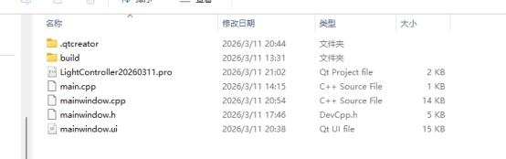
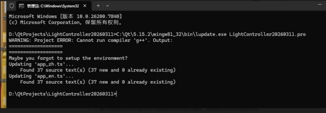
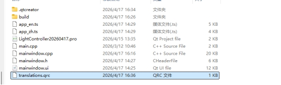
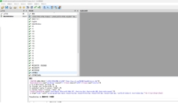
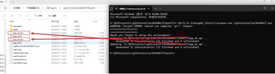
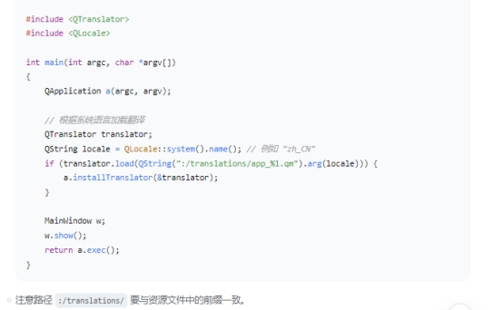

# **QT中英文切换**

 

***\*步骤1：在项目文件（.pro）中启用翻译\****

打开 LightController.pro，找到或添加以下行：

TRANSLATIONS += app_zh.ts app_en.ts//告诉 qmake 我们要生成两个翻译文件：中文和英文。

***\*步骤2：生成 .ts 文件（更新翻译）\****

方法一：使用命令行手动运行 lupdate 和 lrelease（最简单可靠）

①打开命令提示符并进入你的项目目录（在这里cmd进入终端）

②确认你的 Qt 安装路径(得知道 lupdate.exe 和 lrelease.exe 具体在哪个文件夹)：通常它们位于 Qt 的 bin 目录下。常见的 Qt 5.15.2 MinGW 安装路径是C:\Qt\5.15.2\mingw81_32\bin

③运行 lupdate 命令：

C:\Qt\5.15.2\mingw81_32\bin\lupdate.exe LightController20260311.pro,将路径替换成实际的路径

输入后按回车，如果一切正常，你会看到类似下面的输出：

 

app_zh.ts 和 app_en.ts 已经生成项目文件夹中

 

***\*步骤3：使用 Qt Linguist 打开 .ts 文件进行翻译\****

①打开 app_zh.ts 进行中文翻译

1.找到项目文件夹(例D:\QtProjects\LightController20260311),双击 app_zh.ts 文件

2.在 Qt Linguist 窗口中,看到有需要翻译的文本

3.开始翻译中文

点击左侧第一条文本（例如“打开串口”），在下方翻译框中输入对应的中文（如果源文已经是中文，可以直接复制源文到翻译框，或者留空——留空时程序会显示源文）。

输入后，按 Ctrl+Enter 或点击工具栏上的绿色勾号按钮，标记该条目为“已完成”（条目左侧会出现绿色对勾）。

依次处理所有条目，直到左下角的计数从 0/37 变成 37/37

4.保存文件

 

②打开 app_en.ts 进行英文翻译

1.在当前窗口打开 app_en.ts在 Qt Linguist 中，点击菜单 文件 → 关闭，关闭当前的 app_zh.ts。

2.点击 文件 → 打开，选择 app_en.ts，点击“打开”。

3.翻译 app_en.ts

4.保存文件

***\*步骤4：运行 lrelease生成 .qm 文件（二进制翻译文件\*******\*进行\*******\*发布翻译）翻译并保存好两个 .ts 文件后，将它们编译成程序能加载的 .qm 文件。\****

①打开命令提示符：在项目文件夹的地址栏输入 cmd 并回车。

②运行 lrelease 命令（根据Qt 安装路径调整）

执行：C:\Qt\5.15.2\mingw81_32\bin\lrelease.exe LightController20260311.pro

执行后，项目文件夹中会出现 app_zh.qm 和 app_en.qm 文件

 

***\*步骤5：将 .qm 文件集成到项目中\****

①在 Qt Creator 中创建资源文件

右键项目（左栏的 LightController20260311）→ 添加新文件 → Qt → Qt 资源文件 → 命名为 translations.qrc → 完成。

②添加翻译文件到资源

1.双击打开 translations.qrc。

2.点击“添加前缀”，输入 /translations

3.点击“添加文件”，选择项目文件夹中的 app_zh.qm 和 app_en.qm（按住 Ctrl 多选）。

​    4保存资源文件。

③修改 main.cpp 以加载翻译

打开main.cpp,在main()函数中找到加载翻译的部分(如果没有就添加)

 

 

***\*步骤6：在 UI 中启用翻译\****

***\*在项目文件（.pro）中引用资源文件\****

打开 .pro 文件，确认其中已经包含以下行

 

\# 翻译文件资源文件

RESOURCES += translations.qrc

***\*步骤7：编译运行测试\****

 

***\*注意：如果后期更改了中英文需要改界面后\****

***\*①更新代码app_zh.ts (更新中文翻译)， app_en.ts (更新英文翻译)\****

***\*②\******使用****lrelease** **重新生成新的.qm文件**

**③最后重新构建所有项目**

 

 

 

 

 

 

 

#### ***\*X86架构QT源码编译ARM架构的(已经安装好交叉编译工具链)\****

 

 

1. 编译 ARM 版的 Qt 5.15.2 库,ARM 版本的 Qt 库(这里我使用的qt5.15.2),我之前安装过

\# 查找 Qt 5.15.2 源码目录

find ~ -name "qt-everywhere-src-5.15.2" -type d 2>/dev/null

 

2.编译 ARM 版 Qt 5.15.2

 