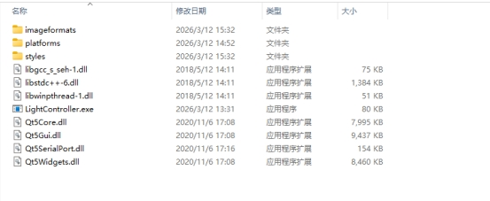

### **QT打包widows系统**

1.打包可执行程序

路径\build\release\项目名.exe （release版本）放到一个文件夹A里

 

2. 打开QT的安装路径（C:\Qt\5.15.2\mingw81_32\bin）复制以下文件

Qt5Core.dll Qt 核心模块

Qt5Gui.dll 图形界面模块

Qt5Widgets.dll 窗口部件模块

Qt5SerialPort.dll 串口通信模块

libgcc_s_seh-1.dll MinGW 运行时（必须）

libstdc++-6.dll MinGW 标准 C++ 库

libwinpthread-1.dll MinGW 线程库

 

3. 复制插件文件夹（可选）

从 C:\Qt\5.15.2\mingw81_64\plugins 复制以下文件夹到A目录：

①：imageformats（支持更多图片格式，如 PNG、JPEG 等）

②：styles（Windows 样式）

③：platforms（确保里面有 qwindows.dll）

 

4. 最终显示如下

####  

 