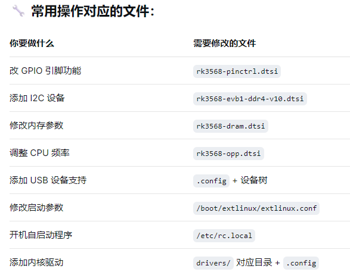

### 1.设备树文件（用于硬件配置）

eg：

✅ 核心文件

- **`rk3568.dtsi`** - SoC 通用定义（不常修改，除非芯片级变更）
- **`rk3568-pinctrl.dtsi`** - 引脚复用配置（**经常修改**，如改 GPIO ，IIC功能）
- **`rk3568-evb1-ddr4-v10.dtsi`** - 板级硬件配置（**经常修改**，如添加外设）
- **`rk3568-evb1-ddr4-v10.dts`** - 最终的设备树文件（编译入口）

✅ **其他常用设备树文件**：

- **`rk3568-linux.dtsi`** - Linux 特定配置（如启动参数）

- **`rk3568-opp.dtsi`** - CPU/GPU 频率电压表（性能调优）

- **`rk3568-dram.dtsi`** - DDR 内存时序配置

  

### 2. 内核配置文件

- **`.config`** 或 **`defconfig`**                     - 内核编译配置（如 `rockchip_linux_defconfig`）
- **`arch/arm64/configs/ `**                   - ARM64 平台默认配置目录
2. **/boot/extlinux/extlinux.conf**         - 修改启动参数
3. **/etc/rc.local**                                         - 开机脚本
4. **/etc/fstab**                                            -  磁盘挂载

### **3. 驱动源文件**

✅ **常用驱动目录**：

- **drivers/gpio/gpio-rk3568.c           **                           # GPIO 驱动**
- **drivers/pinctrl/pinctrl-rockchip.c   **                      # 引脚控制驱动**
- **drivers/clk/rockchip/clk-rk3568.c   **                      # 时钟驱动**
- **drivers/mmc/host/dw_mmc-rockchip.c **             # SD/MMC 驱动**
- **drivers/net/ethernet/stmmac/dwmac-rk.c**       # 以太网驱动**
- **drivers/usb/dwc3/dwc3-rockchip.c    **                  # USB 驱动**

### **4. Bootloader 文件（U-Boot）**

- **configs/evb_rk3568_defconfig            **                    # U-Boot 配置文件
- **arch/arm/dts/rk3568-evb.dts           **                     # U-Boot 设备树
- **include/configs/evb_rk3568.h            **                   # 板级头文件

### **5. 用户空间配置文件**

✅ **系统服务/脚本**：

- **`/etc/rc.local`** - 开机自启动脚本
- **`/etc/fstab`** - 文件系统挂载表
- **`/boot/extlinux/extlinux.conf`** - 启动参数配置

✅ ***设备树覆盖（动态修改）***

/lib/firmware/overlays/             # 设备树覆盖文件目录

###  **6. 构建系统/编译文件**

build.sh                            # RK 官方构建脚本
external/config/                    # 板级配置目录
device/rockchip/rk3568/             # 设备特定文件

**一句话**

- **改硬件配置 → 改 `.dtsi` 文件**
- **改内核功能 → 改 `.config` 文件**
- **改启动项 → 改 `extlinux.conf`**
- **改开机脚本 → 改 `rc.local`**

### **常用操作对应的文件**：

## **一句话记住每个目录**

- **`arch/`** - CPU架构底层代码
- **`drivers/`** - 所有硬件驱动
- **`kernel/`** - 内核调度和核心机制
- **`mm/`** - 内存管理
- **`fs/`** - 文件系统支持
- **`net/`** - 网络协议栈
- **`include/`** - 头文件定义
- **`scripts/`** - 编译构建脚本
- **`Documentation/`** - 使用文档

------

**内核开发黄金法则：**
**硬件配置 → 找 `arch/` 和 `drivers/`**
**内核功能 → 找 `kernel/` 和对应子系统**
**编译问题 → 找 `scripts/` 和 `Makefil`**