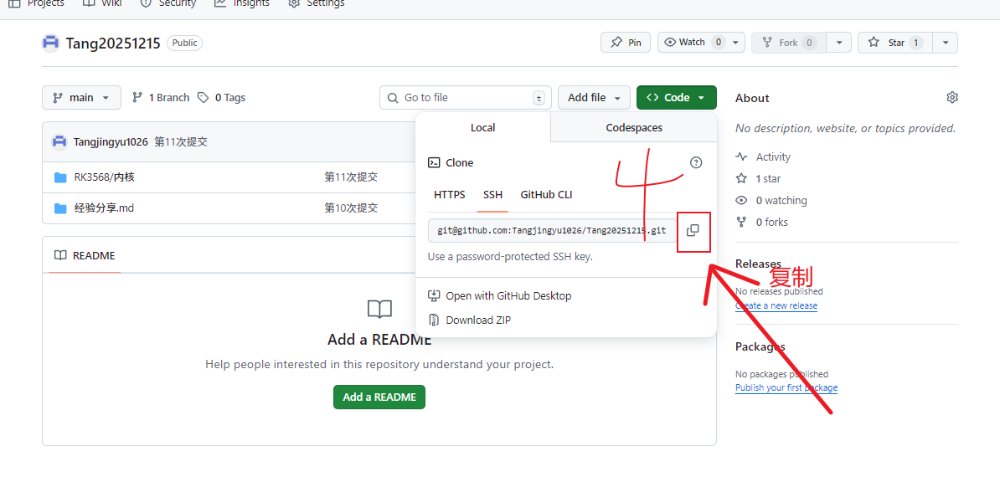
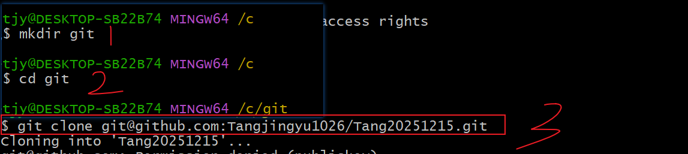

第一步：检查是否已存在SSH密钥，没有就公钥生成

ls -al ~/.ssh

第二步：生成新的SSH密钥

ssh-keygen -t rsa -b 4096 -C "your_email@example.com"

- `-t rsa` 指定密钥类型为RSA。
- `-b 4096` 指定密钥的位数为4096位，这是推荐的安全位数。
- `"your_email@example.com"` 是你的电子邮件地址，用于标识密钥。

执行此命令后，系统会提示你输入一个文件路径来保存密钥，或者你可以直接按回车键使用默认路径（通常在Linux和Mac上是`~/.ssh/id_rsa`，在Windows上是`C:\Users\你的用户名\.ssh\id_rsa`）

第三步：添加SSH密钥到ssh-agent（可选）

①为了在使用Git时自动使用你的SSH密钥，你可以将其添加到`ssh-agent`中。首先，启动`ssh-agent`

eval "$(ssh-agent -s)"

②然后，添加你的私钥到`ssh-agent`

ssh-add ~/.ssh/id_rsa

如果你使用的是默认的密钥文件名，则可以直接使用`ssh-add`命令而不需要指定路径。

第四步：将公钥添加到仓库

最后

