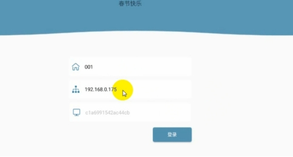
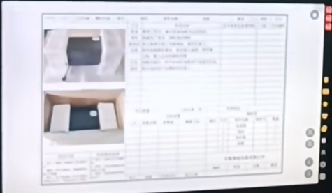
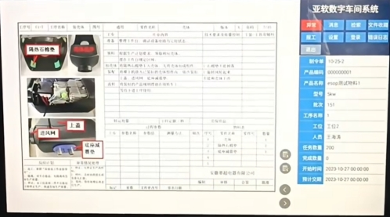
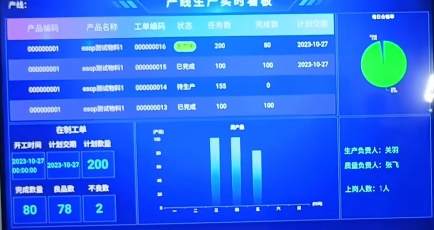
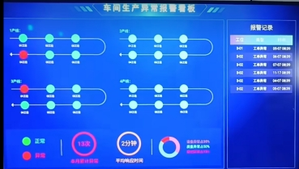
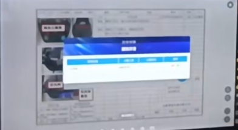

# **ESOP项目开发计划**

# **项目选型：**

## **选择原因：**

对比了两种语言 Java Python，

Java 插件多，生态完整。项目稳定。开发周期相对长一些。

Python  插件多，生态完整。开发效率高。

使用Java 语言，因为后期要开发 Android 系统，Andriod 使用的就是  Java 语言 Kotlin 和Java 语法很像。

## **选用 Java 开源项目：**

后端：https://github.com/yangzongzhuan/RuoYi 

前端：https://gitcode.com/yangzongzhuan/RuoYi-Vue3 

Demo: https://vue.ruoyi.vip/login?redirect=%2Findex

## **使用技术栈：**

Vue3 + Spring Boot 4.x (JDK 17+)

项目参考链接： https://www.bilibili.com/video/BV1Jz4y1N7zE/?spm_id_from=333.788.top_right_bar_window_history.content.click&vd_source=dd742a2a56147b192ac6d1ad505a8524

# **环境部署：****3-5 天**

部署后端软件 Java tomcat mysq redis

部署前端软件 npm nvm 

代码管理软件：gitlab 代码管理平台（后期多个项目管理）1天

本地环境搭建 1-2天

数据库连接工具（mysql,redis）， java 环境，npm 前端环境，开源项目运行。

服务器环境搭建 1-2天

java 环境.

# **开发计划：**

### **搭建环境：3-5天**

本地环境，开源项目运行

生产服务器环境

代码管理工具1天

### **一期实现功能：19-22天**

数据表设计 ，画出表之间的逻辑关系。3天

产线工位填写页面，数据联调 （告诉后端是哪个工位，好来分配工序）1天

产线工位展示页面，数据联调（展示后台发放的图片和PDF等文件）3天

后端工位管理，（在工位上输入对应的编号）4-5天

后端文件管理（添加图片，修改，删除），4-5天

后端工序管理。4-5天

### **二期实现功能：7-8天**

文件管理，新增 PDF，视频管理，文件格式。2天

前端，新增 PDF 显示对应的文档。视频展示。后端设置显示是图片还是文档PDF文件。1天

产线管理，产线中，包含工序的流程。修改产线，删除产线。4-5天

### **三期实现功能：12天**

单个产线中，使用条码记录每个产品状态。方案待定

安灯呼叫功能。方案待定

新增看板功能。5天

工位文件搜藏。7天

### **四期实现功能：10-11天**

新增安卓功能。搭建本地安卓开发环境。2天

填写工位号，服务器地址信息 1天

发放文件展示，及产品信息展示。2天

上报产品良率信息。2天

文件搜藏展示。搜藏列表，打开文件。3-4天

# **功能梳理和实现：51-56天**

### **工位展示页面：4天**

工位设备，填写工位号，访问服务器地址后。展示图片界面。

 

 

 

 

填写工位编号页面 1天

展示 图片页面 1天 

数据联调调试接口。2天

### **工位管理：4-5天**

包含：派工。

后台接口添加 工位添加，修改， 1-2天

后台接口 删除，查看 并提供接口 1天

后台页面添加 工位添加，修改， 1天

后台页面删除，查看 并提供接口 1天

### **文件管理：4-5天**

上传，修改，查看，删除。

后台接口 上传图片，修改图片，查看图片，删除图片  1-2天

后台接口 上传 PDF 文件 1天

后台页面 上传图片，修改图片，查看图片，删除图片  1天

后台页面 上传 PDF 文件 1天

### **工序管理：4-5天**

后台接口工序添加（工序名称，显示的图片，显示的文档等相关信息），修改 1-2天

后台接口删除，查看。1天

后台页面工序添加（工序名称，显示的图片，显示的文档等相关信息），修改 1天

后台页面删除，查看。1天

### **产线管理：4-5天**

后台接口产线添加（产线名称，指定工序的步骤,， 有哪些步骤），修改1-2天

后台接口产线删除，查看。1天

后台页面产线添加（产线名称，指定工序的步骤,， 有哪些步骤），修改1天

后台页面产线删除，查看。1天

### **看板数据统计：5天**

 

 

后台接口数据统计：产品名称，产品编码，状态，任务数量，完成数量，计划交付。

在制工单：开工时间，计划交付，计划数量，完成数量，良品数，不良数。4天

页面数据展示：产品名称，产品编码，状态，任务数量，完成数量，计划交付。

在制工单：开工时间，计划交付，计划数量，完成数量，良品数，不良数。1天

 

### **安灯呼叫：方案待定。**

安装点击呼叫按钮，即发出声音，和灯的颜色改变，后台系统则看板处，看到报警信号，去现场处理。灯问题处理后，并解除报警。

硬件适配驱动，触发请求后端地址。

后端提供接口并后端展示呼叫界面。

前端页面展示列表。

 

 

### **工位文件收藏：7天**

工位可以查看系统的文件列表，并对使用到的文件进行搜藏，以便后期，点击查看。

后端接口，搜藏列表，查看详情。2天

后端接口，搜索修改，1天

前端页面，搜索列表，查看详情，1天

前端页面，搜索修改，1天。

工位页面搜藏展示：1天

后台接口，添加工位搜藏的文件。1天

### **安卓软件开发** **10-11天**

新增安卓功能。搭建本地安卓开发环境。2天

填写工位号，服务器地址信息 1天

发放文件展示，及产品信息展示。2天

上报产品良率信息。2天

文件搜藏展示。搜藏列表，打开文件。3-4天

### **数据库表设计：3天**

设计，工位数据表，文件数据表，工序数据表，产线数据表，产线工序关联表。3天

### **测试功能：6天**

功能测试。

工位管理：1天

文件管理：1天

工序管理：1天

产线管理：1天

看板数据统计：2天

#  

 

 