# **Ubuntu使用Qt5.15.2编译X86和ARM**

注意：

系统属性是 5.15.0-139-generic  20.04.1-Ubuntu 

给到安装包，是从官网下载的。当前教程，依赖当前的安装包，后期有新版本发布的情况下，有安装的和编译的参数的差异，具体报错信息，具体解决，提供安装编译的思路。

QT注册地址：https://login.qt.io/register

交叉编译地址：https://download.qt.io/archive/qt/5.15/5.15.2/single/

QT依赖打包：https://github.com/probonopd/linuxdeployqt/releases 

## **一，Ubuntu 20.04安装Qt 5.15**

### **1.注册Qt账号**

使用安装工具必须要输入账号，所以安装之前要注册个账号

### **2将Qt文件里面的开发包放到虚拟机里**

注意不要放到桌面，我这里放到了桌面，后期进行了更改)

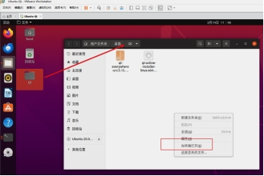 

### **3.在当前界面打开终端执行以下命令行**

(1) 更新软件资源列表

sudo apt update

(2) Qt安装程序启动的图形库

sudo apt install libxcb-cursor0 libxcb-cursor-dev

(3)给文件添加可执行权限

chmod +x qt-online-installer-linux-x64-4.8.1.run 

(4)以管理员权限运行当前目录下的这个安装程序

sudo ./qt-online-installer-linux-x64-4.8.1.run 

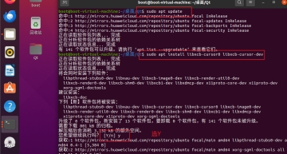 

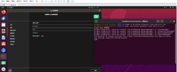 

### **4.输入注册的账号，点下一步(Next)，等待登录**

### 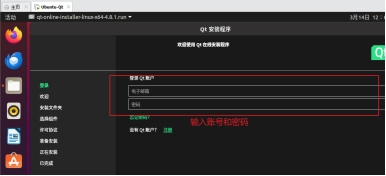

### **5.登录成功开始安装**

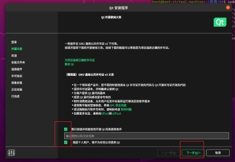 

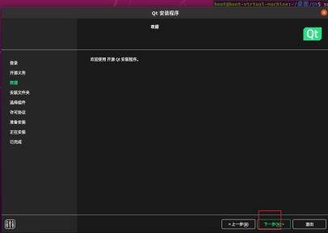 

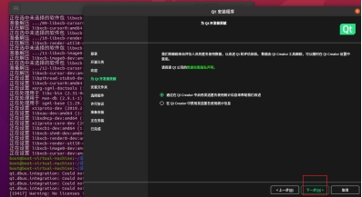 

因为前面命令执行：sudo ./qt-online-installer-linux-x64-4.8.1.run ，所以默认路径是 /opt/Qt

默认，然后下一步(Next)

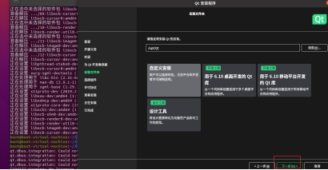 

使用旧版本的Qt把旁边的Archive勾选上，然后点击筛选(Filter)，它就会重新加载，筛选后会出现很多Qt版本，然后选择你需要的版本。

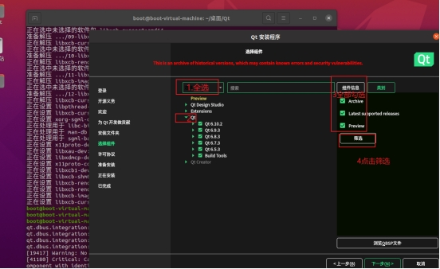 

这里我选这Qt5.15.2，因为Qt官方博客对Qt5.15有详细介绍权威性高，是目前最主流的选择，你可根据需求选择你需要的版本。然后根据求选择组件，你可以按照自己的需求选择（勾的越多占的内存越多，如果你把 Android 勾上了，后续还需配置Android环境）。勾选以后点击下一步。

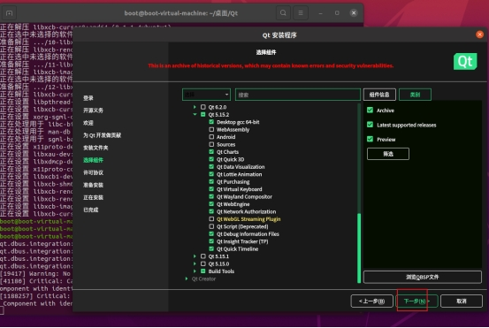 

注意这里QtCreator，里面的19.0.0目前不要使用，安装以后Qt Creator 19.0.0 版本与Ubuntu 20.04 系统不兼容后期我们进行单独安装Qt Create。

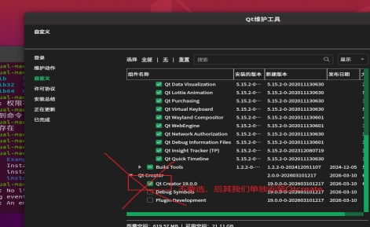 

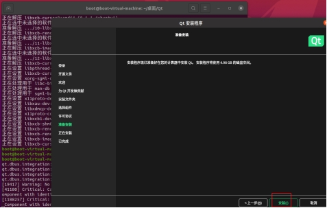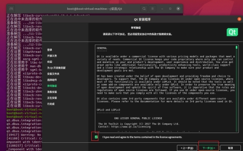 

之后等待安装(时间2小时左右)

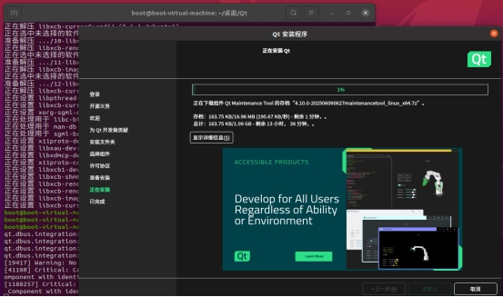 

 

点击完成

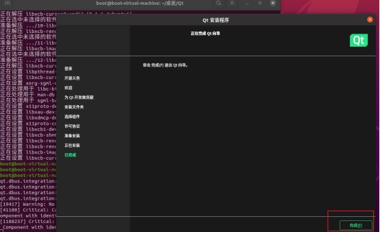 

 

### **6.开始安装未安装的QtCreate**

接下来我们安装刚刚未安装的QtCreate

Ubuntu安装指定版本Qt Creator 18.02

(1)执行以下命令

chmod +x qt-creator-opensource-linux-x86_64-18.0.2.run

sudo ./qt-creator-opensource-linux-x86_64-18.0.2.run

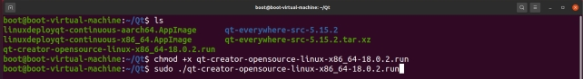 

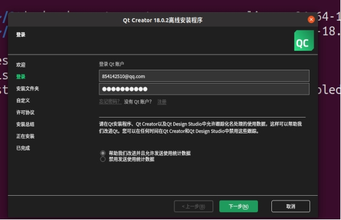 

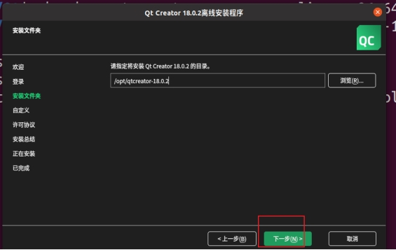 

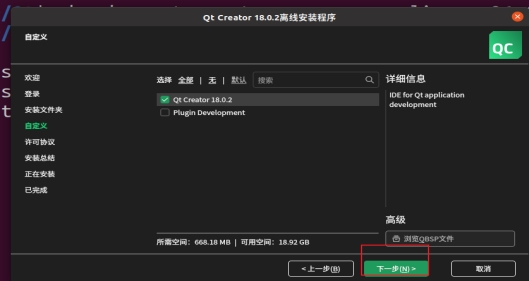 

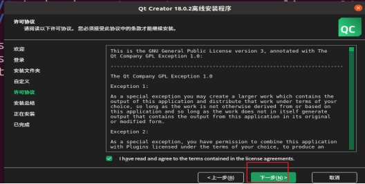 

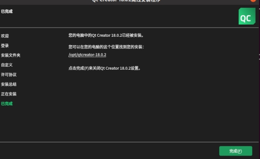 

至此我们的qt已经完全安装完成

## **二、安装交叉编译工具链**

### **1.解压qt-everywhere-src-5.15.2.tar.xz包**

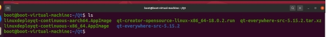 

tar -xf qt-everywhere-src-5.15.2.tar.xz

解压完成后就进入qt-everywhere-src-5.15.2目录在终端执行

### **2.更新软件包列表**

sudo apt update

### **3.安装 build-essential 包**

sudo apt install build-essential

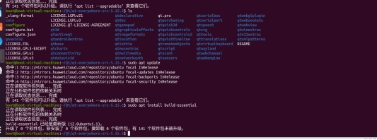 

### **4.****安装 ARM64 交叉编译工具链**

#### **4.1.Ubuntu 系统上安装ARM64架构的C++交叉编译工具链**

sudo apt install g++-aarch64-linux-gnu binutils-aarch64-linux-gnu

 

#### **4.2.进入qt-everywhere-src-5.15.2目录给configure 添加执行权限**

chmod +x configure

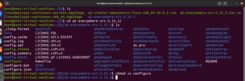 

#### **4.3.配置sysroot**

配置完整的交叉编译环境，缺少目标系统（ARM64）的基础库和头文件，也就是没有配置好sysroo

①准备ARM64的sysroot(使用debootstrap工具构建)

\# 1.安装必要工具

sudo apt install debootstrap qemu-user-static binfmt-support

\# 2.创建一个目录作为 sysroot

export SYSROOT_DIR=~/sysroot-arm64

mkdir -p $SYSROOT_DIR

\# 3.运行 debootstrap 获取基础系统（以 Ubuntu 20.04 Focal 为例）

sudo debootstrap --arch=arm64 --foreign focal $SYSROOT_DIR http://ports.ubuntu.com/ubuntu-ports/

\# 4.使用 QEMU 模拟 ARM 环境，完成第二阶段的配置

sudo cp /usr/bin/qemu-aarch64-static $SYSROOT_DIR/usr/bin/

sudo chroot $SYSROOT_DIR /debootstrap/debootstrap --second-stage

\# 5.在 chroot 环境中安装交叉编译 Qt 可能需要的额外开发库

sudo chroot $SYSROOT_DIR

apt update

exit # 退出 chroot 环境

②修改Qt的mkspecs 配置文件(Qt 需要知道你的交叉编译器和sysroot的具体位置。你需要修改对应的配置文件来指定这些路径)

进入 Qt 源码目录,打开终端，确保你在之前解压的 Qt 5.15.2 源码根目录下：

cd ~/Qt/qt-everywhere-src-5.15.2

nano qtbase/mkspecs/linux-aarch64-gnu-g++/qmake.conf

将光标移动到文件末尾（使用方向键向下滚动到最后一行之后）。

添加以下三行内容（直接粘贴或手动输入）：

\# 告诉编译器使用 sysroot

QMAKE_CFLAGS       = --sysroot=/home/boot/sysroot-arm64

QMAKE_CXXFLAGS      = --sysroot=/home/boot/sysroot-arm64

QMAKE_LFLAGS       = --sysroot=/home/boot/sysroot-arm64

 

重要：请确保 /home/boot/sysroot-arm64 是你用 debootstrap 实际创建的 sysroot 目录路径。如果不确定，可以执行 ls /home/boot/sysroot-arm64 确认该目录存在。

保存并退出：

  按 Ctrl + O，然后按 Enter 确认保存。

  按 Ctrl + X 退出 nano。

#### **4.4配置 Qt 5.15.2 的编译参数**

cd ~/Qt/qt-everywhere-src-5.15.2

./configure -release -opensource -confirm-license -xplatform linux-aarch64-gnu-g++ -sysroot /home/boot/sysroot-arm64 -prefix /opt/qt-5.15.2-arm64 -nomake examples -no-opengl -qpa linuxfb -skip qtlocation -v

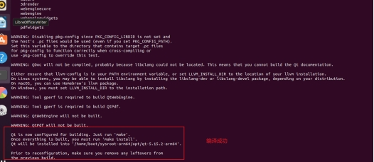 

(1)开始编译

make -j$(nproc)

编译完成后输入确认是否编译成功：echo $?

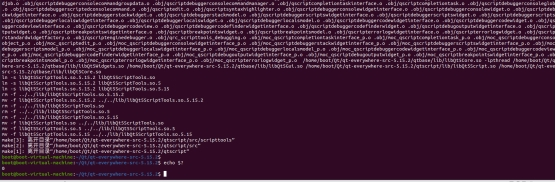 

(2).继续在当前终端执行，安装到指定目录：/home/boot/sysroot-arm64/opt/qt-5.15.2-arm64

执行：make install

(3).执行完成后。查看Qt核心是否正确构建并安装

ls -l /home/boot/sysroot-arm64/opt/qt-5.15.2-arm64/bin/qmake

 

## 三、**运行项目**

#### 1. **打开项目**

 

 

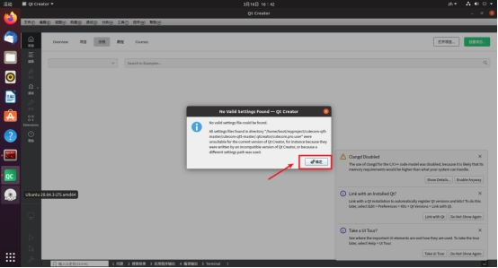 

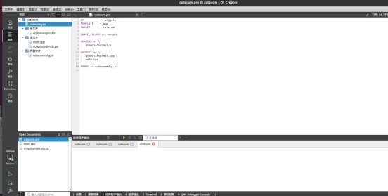 

#### 2. **添加qmake路径进行构建X86和arm64架构**

#### (1) **添加arm64架构qmake QT版本**

#### 1) **点击项目-管理构建套件-构建套件-Qt版本-一添加**

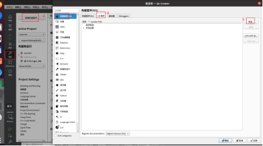 

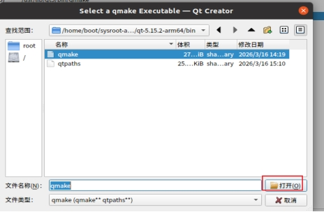 

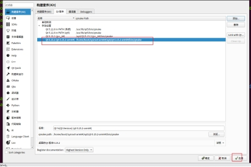 

#### (2) **添加X86架构qmake QT版****本**

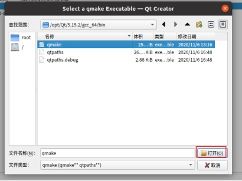 

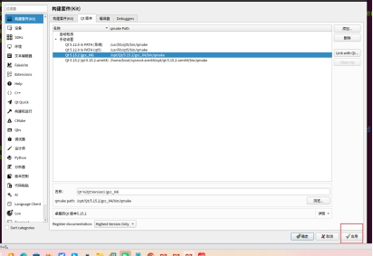 

#### (3) **构建套件进行添加**

   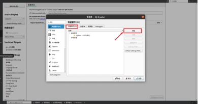

#### 1) **构建添加gcc_64套件**

  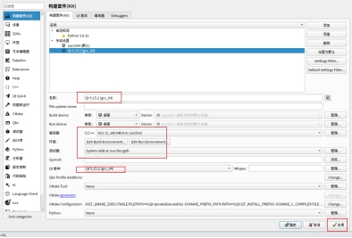

#### 2) **构建添加arm_64套件（如果没有）**

  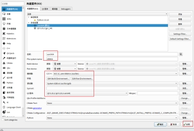

至此我们的套件添加完成接下来进行编译项目并进行构建

 

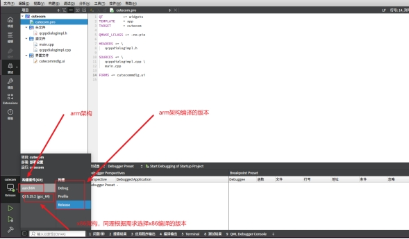 

#### 3. **编译构建效果**

 

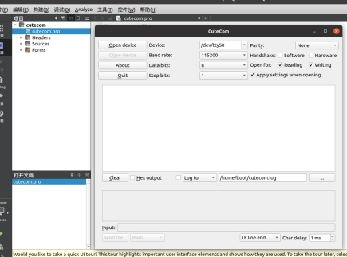 

#### 4. **编译 x86 架构时候，报错信息。**

如果遇到了报错的话，qt.qpa.plugin: Could not load the Qt platform plugin "xcb" in "" even though it was found.  则需要安装依赖 

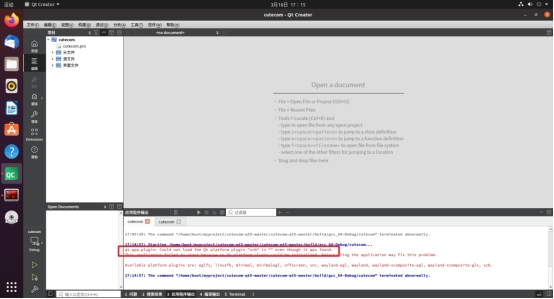 

 

解决问题的指令如下：

sudo apt install \

libxcb-xinerama0 \

libxcb-xinerama0-dev \

libxkbcommon-x11-0 \

libxcb-icccm4 \

libxcb-image0 \

libxcb-keysyms1 \

libxcb-render-util0 \

libxcb-xfixes0 \

libxcb-shape0 \

libxcb-randr0 \

libxcb-sync1 \

libxcb-xkb1 \

libxcb-util1 \

libxrender1 \

libxi6

 

 

 

 

## **四、****Linux下Qt程序的打包发布-使用第三方工具linuxdeployqt**

linuxdeployqt 是Linux下的qt打包工具，可以将应用程序使用的资源（如库，图形和插件）复制到二进制运行文件所在的文件夹中。这里以X86为例，arm架构也是同理

### **1.****安装linuxdeployqt**

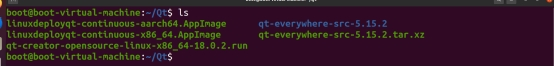 

将linuxdeployqt-continuous-x86_64.AppImage改名为linuxdeployqt-continuous-x86

，并chmod +x，然后复制到 /usr/local/bin/；然后命令行输入 linuxdeployqt-x86 -version，查看是否安装成功，若输出版本信息表示安装成功。

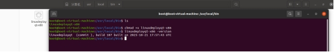 

### **2.配置Qt的环境变量**

1.终端输入vim ~/.bashrc 命令，进行修改.bashrc文件，在文件末尾追加以下内容，其中

/opt/Qt/5.15.2/gcc_64是我Qt的安装路径，用自己的QT安装路径代替

\#add QT ENV

export PATH=/opt/Qt/5.15.2/gcc_64/bin:$PATH

export LD_LIBRARY_PATH=/opt/Qt/5.15.2/gcc_64/lib:$LD_LIBRARY_PATH

export QT_PLUGIN_PATH=/opt/Qt/5.15.2/gcc_64/plugins:$QT_PLUGIN_PATH

export QML2_IMPORT_PATH=/opt/Qt/5.15.2/gcc_64/qml:$QML2_IMPORT_PATH

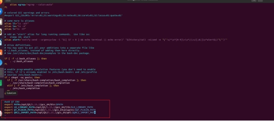 

3.source让.bashrc这个shall文件立即生效

执行：source ~/.bashrc

### **3.****打包应用程序**

将Qt项目用Release模式编译运行一遍

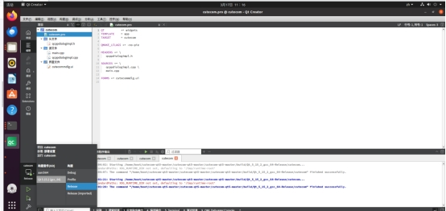 

### **4打开我们项目所在的位置**

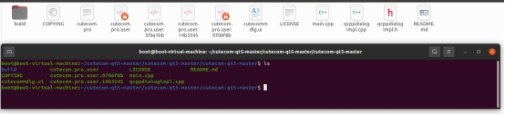 

进入build目录创建一个Qt打包的程序，放到我们创建的文件夹cutecom里，并将我们使用的cutecom进行

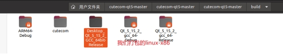 

 

 

把打包的运行程序cutecom放到我们创建的cutecom文件夹里

 

打开cutecom的终端执行以下命令

/usr/local/bin/linuxdeployqt-x86 cutecom -appimage

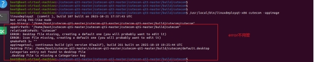 

最终文件夹cutecom的内容

 

### 5. **最后包linux-x86下的cutecom文件夹在linux-x86运行QT编译的程序**

## **五、验证过程**

### **1.将编译好的 build 可执行文件 拷贝到 对应架构中 arm64**

 

### 2. **将编译好的 build 可执行文件 拷贝到 对应架构中 x86** 

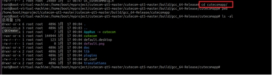 

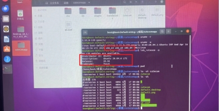 

 

### 3. **连接使用485协议进行通信**

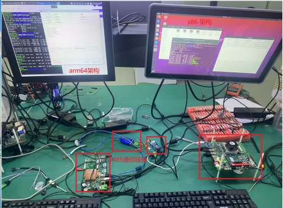 

### 4. **发送指令接收指令，通信成功**

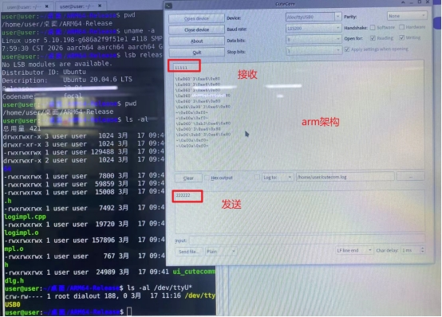 

 

###  

 

 

 

 

 

 

​      