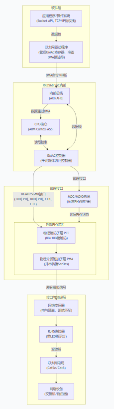

### **如何确定您的RK3568开发板上的“千兆网卡”？**

根据您的原理图，您可以按以下步骤确认：

#### **第一步：找到GMAC控制器（在RK3568内部）**

查看RK3568的数据手册或您原理图中的**框图**（如第3、9页）。您会找到：

- **GMAC0** 和 **GMAC1** 模块。这是网卡的“大脑”所在地。

#### **第二步：找到PHY芯片（在RK3568外部）**

在原理图中搜索 **“RTL8211F”**、**“YT8531”** 或类似型号。这就是**物理层芯片**。您的文档第33、34页清晰地展示了两个PHY芯片电路。

#### **第三步：确认连接方式**

看PHY芯片与RK3568的连接信号。如果是千兆，您会看到一组 **RGMII** 接口信号，例如：

- `GMACx_TXD[3:0]` (4条数据线)
- `GMACx_TXCLK` (125MHz时钟)
- `GMACx_RXD[3:0]`
- `GMACx_RXCLK`
- `GMACx_MDC` / `GMACx_MDIO` (管理接口)

**关键证据**：在您文档第33页，U30芯片（RTL8211F-CG）的引脚15-20连接的就是`TXD3, TXD2, TXD1, TXD0, TXCTL, TXC`，这明确是 **RGMII接口**，对应千兆速率。

#### **第四步：最终确认**

一个完整的“千兆网卡”通道，必须同时满足以下三点：

1. **RK3568端**：有GMAC控制器。
2. **连接**：通过RGMII/SGMII等千兆接口与外部PHY芯片相连。
3. **PHY端**：芯片型号支持10/100/1000Mbps（如RTL8211F）。
4. **网络接口**：最终通过网络变压器连接到RJ45座子。

在您的板子上，**GMAC0 + RTL8211F(第33页) + RJ45座子(RJ1)** 共同组成了**第一块千兆网卡**。**GMAC1 + 另一颗RTL8211F(第34页) + 另一个RJ45座子** 组成了**第二块千兆网卡**。

------

### **总结与一句话回答**

**千兆网卡 ≠ GMAC。**

- **GMAC** 是网卡的**数字逻辑核心**，集成在SoC（如RK3568）内部。
- **PHY** 是网卡的**物理收发器**，是必须外接的独立芯片。
- **千兆网卡** 是 **GMAC + PHY + 网络变压器 + RJ45接口** 的**完整硬件实体**。

**所以，当您说“我的板子有千兆网卡”时，您是对的，因为它包含了所有必要组件。当您说“我的RK3568有两个GMAC”时，您也是对的，这指的是它内部有两个可以用于组建网卡的核心控制器。** 两者描述的是同一硬件系统的不同层面。